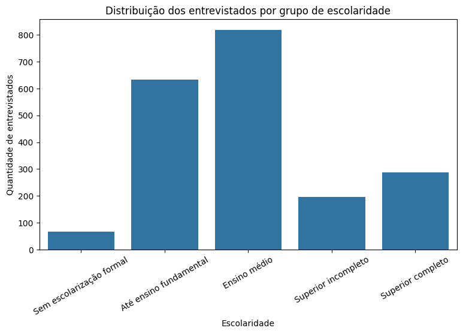
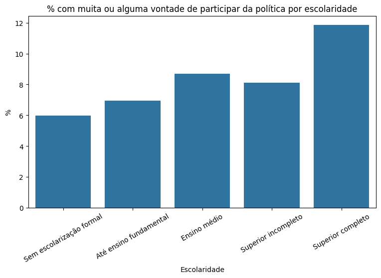
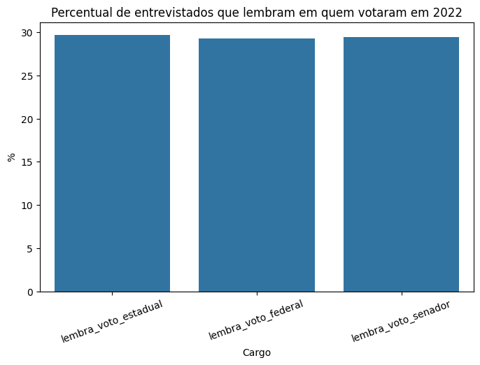
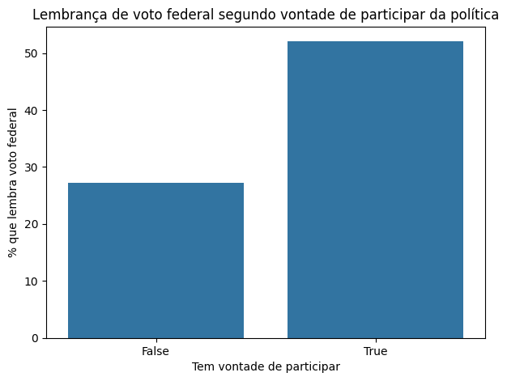
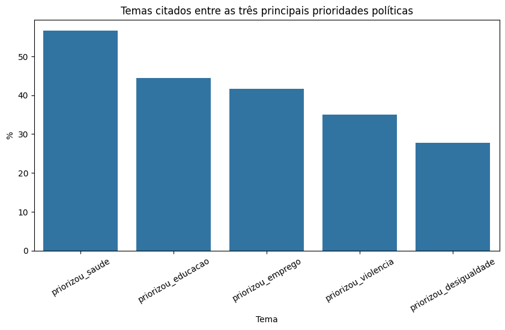
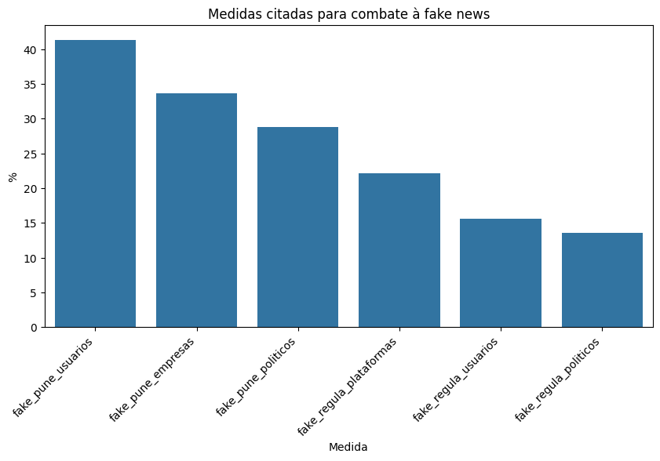
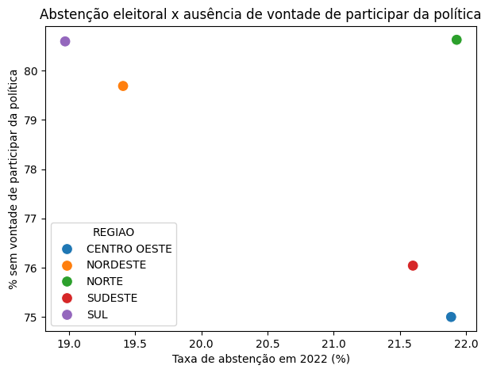
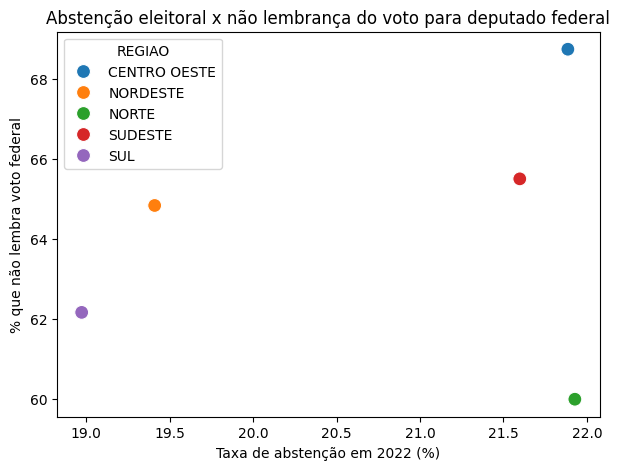

# Projeto I - Análise Exploratória de Dados

## Percepção dos brasileiros acerca da democracia e participação política

## 1. Introdução

A democracia depende não apenas da existência de instituições formais, eleições periódicas e regras constitucionais, mas também da forma como os cidadãos se relacionam com a política. Aspectos como memória de voto, disposição para participação política, percepção sobre fake news e prioridades atribuídas aos representantes públicos ajudam a compreender o grau de engajamento da população com a vida democrática.

Este trabalho tem como objetivo realizar uma Análise Exploratória de Dados, ou EDA, a partir da pesquisa CESOP/IPEC 04832 - “Percepção dos brasileiros acerca da democracia”. A pesquisa foi realizada no Brasil entre os dias 01 e 05 de setembro de 2023, com uma amostra de 2.000 eleitores de 16 anos ou mais. A base contém variáveis sociodemográficas, como sexo, idade, escolaridade, raça/cor, religião, renda, região, condição e porte do município, além de perguntas relacionadas à lembrança de voto nas eleições de 2022, prioridades políticas, percepção sobre fake news e vontade de participar da vida política.

A análise se concentra em quatro eixos principais:

- Caracterização do perfil sociodemográfico dos entrevistados
- Memória de voto nas eleições gerais de 2022
- Prioridades políticas e percepção sobre fake news
- Relação entre escolaridade, idade e disposição para participação política

Além da base CESOP/IPEC, o projeto também prevê a utilização de dados públicos do Tribunal Superior Eleitoral, especialmente indicadores de comparecimento e abstenção eleitoral em 2022. Essa base complementar será usada para comparar os padrões declarados na pesquisa de opinião com indicadores eleitorais observados por região.

A pergunta central do trabalho pode ser formulada da seguinte maneira:

Como características sociodemográficas, especialmente escolaridade, idade e região, se relacionam com memória de voto, prioridades políticas, percepção sobre fake news e disposição para participação política no Brasil?

A partir dessa pergunta, o trabalho busca identificar padrões exploratórios e possíveis associações entre perfil social e comportamento político declarado.

## 2. Métodos

### 2.1 Base de dados principal

A base principal utilizada neste trabalho é a pesquisa CESOP/IPEC 04832, intitulada “Percepção dos brasileiros acerca da democracia”. A pesquisa possui 2.000 observações e contempla eleitores brasileiros de 16 anos ou mais.

As principais variáveis utilizadas foram:

| Variável | Descrição |
| --- | --- |
| SEXO | Sexo do entrevistado |
| IDADE | Idade do entrevistado em anos |
| FX_ID | Faixa etária |
| ESCOLARIDADE | Nível de escolaridade |
| P1A | Lembrança do voto para deputado estadual em 2022 |
| P1B | Lembrança do voto para deputado federal em 2022 |
| P1C | Lembrança do voto para senador em 2022 |
| P2_1, P2_2, P2_3 | Três principais prioridades esperadas de um político |
| P3_1 a P3_6 | Medidas apontadas para combater fake news |
| P4 | Vontade de participar da vida política na cidade |
| RACA | Raça/cor do entrevistado |
| RELIGIAO | Religião declarada |
| REND1 | Renda pessoal em salários mínimos |
| REND2 | Renda familiar em salários mínimos |
| REGIAO | Região do Brasil |
| COND | Condição do município |
| PORTE | Porte do município |

A análise foi realizada em Python, em ambiente Jupyter Notebook/Google Colab, com uso das bibliotecas pandas, numpy, matplotlib, seaborn e scipy.

### 2.2 Tratamento dos dados

Inicialmente, foi feita a inspeção da estrutura da base, verificando número de linhas, colunas, tipos de dados e valores ausentes. Em seguida, foram analisadas as frequências das variáveis categóricas para compreender a distribuição das respostas.

Algumas variáveis da base original possuíam códigos associados a respostas como “não sabe” ou “não respondeu”. Esses casos foram mantidos em análises descritivas gerais, mas removidos ou tratados como valores ausentes nas análises estatísticas que exigiam respostas válidas.

Também foram criadas variáveis derivadas para facilitar a interpretação dos resultados. Entre elas:

| Nova variável | Critério de criação |
| --- | --- |
| tem_vontade_participar | Entrevistados que responderam “muita vontade” ou “alguma vontade” em P4 |
| sem_vontade_participar | Entrevistados que responderam “nenhuma vontade” em P4 |
| lembra_voto_federal | Entrevistados que declararam lembrar em quem votaram para deputado federal |
| nao_lembra_voto_federal | Entrevistados que declararam não lembrar em quem votaram para deputado federal |
| priorizou_saude | Entrevistados que citaram saúde entre as três prioridades políticas |
| priorizou_emprego | Entrevistados que citaram geração de empregos entre as três prioridades políticas |
| priorizou_educacao | Entrevistados que citaram educação entre as três prioridades políticas |
| priorizou_violencia | Entrevistados que citaram redução da violência entre as três prioridades políticas |
| fake_pune_politicos | Entrevistados que citaram punição a políticos que divulgam fake news |
| fake_pune_empresas | Entrevistados que citaram punição a empresas de tecnologia/comunicação |

A variável ESCOLARIDADE, originalmente bastante detalhada, foi reagrupada para melhorar a visualização e a análise estatística. O agrupamento utilizado foi:

| Grupo criado | Categorias incluídas |
| --- | --- |
| Sem escolarização formal | Analfabeto; sabe ler/escrever, mas não cursou escola; pré-escola |
| Até ensino fundamental | 1ª à 8ª série do ensino fundamental |
| Ensino médio | 1ª, 2ª e 3ª série do ensino médio |
| Superior incompleto | Superior incompleto |
| Superior completo | Superior completo |

Esse agrupamento foi necessário porque a variável original possuía muitas categorias, o que dificultaria a leitura dos gráficos e poderia gerar tabelas de contingência muito fragmentadas.

### 2.3 Técnicas de análise

Foram aplicadas técnicas de análise exploratória de dados, incluindo:

- Frequências absolutas e relativas
- Distribuição de variáveis categóricas
- Análise de idade por histograma e estatísticas descritivas
- Gráficos de barras para comparação de grupos
- Cruzamentos entre variáveis sociodemográficas e respostas políticas
- Criação de indicadores binários
- Agregação de dados por região
- Teste de Mann-Whitney U

A análise foi organizada em torno dos seguintes blocos:

- Perfil da amostra
- Distribuição da escolaridade
- Vontade de participação política
- Memória de voto
- Prioridades políticas
- Percepção sobre fake news
- Relação entre idade e participação política
- Preparação da base agregada por região para posterior cruzamento com dados do TSE

### 2.4 Teste de hipótese aplicado

Além das análises descritivas, foi aplicado o Teste de Mann-Whitney U para comparar a distribuição da idade entre dois grupos independentes:

- Entrevistados com vontade de participar da política
- Entrevistados sem vontade de participar da política

A variável P4 foi transformada em uma variável binária. As respostas “muita vontade” e “alguma vontade” foram agrupadas como tem vontade de participar, enquanto a resposta “nenhuma vontade” foi classificada como não tem vontade de participar.

As hipóteses testadas foram:

- H0: a distribuição da idade é semelhante entre os entrevistados com e sem vontade de participar da política.
- H1: a distribuição da idade é diferente entre os entrevistados com e sem vontade de participar da política.

O teste de Mann-Whitney foi escolhido porque não exige pressuposto de normalidade e é adequado para comparar dois grupos independentes em relação a uma variável numérica.

O p-valor obtido foi:

```text
p-valor = 0.2644019711247433
```

Considerando nível de significância de 5%, a interpretação foi:

```text
Não há evidência estatística suficiente para afirmar diferença na distribuição da idade entre os grupos.
```

## 3. Discussão dos resultados

### 3.1 Perfil da amostra

A primeira etapa da análise consistiu na caracterização da amostra. A base possui entrevistados de diferentes regiões, faixas etárias, níveis de escolaridade, raças/cores, religiões, rendas e portes de município.

A variável de escolaridade apresentou concentração relevante em alguns grupos. A categoria “3ª série”, interpretada como conclusão do ensino médio dentro da estrutura da base, concentrou aproximadamente 31,20% dos entrevistados. Em seguida, aparecem superior completo, com 14,35%, 8ª série ou 9º ano, com 10,35%, e superior incompleto, com 9,85%.

Após o agrupamento da escolaridade, observou-se que a amostra possui presença expressiva de entrevistados com ensino médio, seguida por entrevistados com ensino fundamental e ensino superior. Esse resultado é importante porque a escolaridade pode influenciar variáveis associadas à participação política, memória eleitoral e percepção sobre temas públicos.

Figura 1 - Distribuição dos entrevistados por grupo de escolaridade

```text

```

### 3.2 Vontade de participação política

A variável P4 mede a vontade declarada dos entrevistados de participar da vida política em sua cidade. Essa variável é central para o trabalho, pois está diretamente relacionada ao engajamento democrático.

A análise mostrou predominância da resposta “nenhuma vontade”, indicando baixo interesse declarado pela participação política local. Esse resultado sugere uma possível distância entre os cidadãos e os espaços formais ou informais de participação política.

Figura 2 - Distribuição da vontade de participação política

```text

```

Também foi analisada a relação entre escolaridade e vontade de participação política. O objetivo foi verificar se níveis mais altos de escolaridade estão associados a maior disposição para participação.

Figura 3 - Percentual com muita ou alguma vontade de participar da política por escolaridade

```text

```

A partir desse gráfico, observou-se que:

```text
os grupos com maior escolaridade apresentaram maior percentual de entrevistados com alguma ou muita vontade de participar da política

```

### 3.3 Memória de voto

A pesquisa também investigou se os entrevistados lembravam em quem votaram para cargos legislativos nas eleições gerais de 2022: deputado estadual, deputado federal e senador.

A memória de voto é uma variável relevante para o estudo da democracia porque pode indicar maior ou menor acompanhamento do processo eleitoral. Baixa lembrança do voto pode estar relacionada à baixa identificação com os representantes eleitos, ao desinteresse político ou à menor saliência dos cargos legislativos em comparação com cargos executivos.

Foram analisadas as variáveis:

- P1A: lembrança do voto para deputado estadual
- P1B: lembrança do voto para deputado federal
- P1C: lembrança do voto para senador

Figura 4 - Percentual de entrevistados que lembram em quem votaram em 2022

```text

```

Também foi analisada a relação entre memória de voto e vontade de participação política. Essa comparação busca verificar se entrevistados mais dispostos a participar da vida política também apresentam maior lembrança do voto.

Figura 5 - Lembrança de voto federal segundo vontade de participação política

```text

```

A interpretação esperada é:

```text
os entrevistados com alguma ou muita vontade de participar da política apresentaram maior percentual de lembrança do voto para deputado federal.
```

### 3.4 Prioridades políticas

As variáveis P2_1, P2_2 e P2_3 registram as três principais prioridades que os entrevistados acreditam que deveriam ser adotadas por um político. Para melhorar a análise, foram criados indicadores binários que indicam se determinado tema foi citado em qualquer uma das três posições.

Foram analisadas as seguintes prioridades:

- Redução das desigualdades sociais
- Geração de empregos
- Melhoria da saúde
- Melhoria da educação
- Redução da violência

Figura 6 - Temas citados entre as três principais prioridades políticas

```text

```

A análise das prioridades permite identificar quais temas possuem maior peso na percepção dos entrevistados. Em geral, temas como saúde, emprego, educação, desigualdade e violência tendem a aparecer como dimensões centrais da agenda pública.

A interpretação dos resultados foi:

```text
“saúde, educação e geração de empregos apareceram entre os temas mais citados, indicando que demandas sociais e econômicas ocupam posição central na percepção dos entrevistados.
```

### 3.5 Percepção sobre fake news

Outro eixo importante da pesquisa diz respeito às medidas que os entrevistados acreditam que poderiam contribuir para o combate à divulgação de fake news. Esse tema é relevante porque a circulação de informações falsas pode afetar a confiança nas instituições, o processo eleitoral e o debate público.

Foram criadas variáveis binárias para identificar entrevistados que citaram:

- Regulação de plataformas digitais
- Punição de empresas de tecnologia/comunicação
- Regulação de usuários
- Punição de usuários
- Regulação de políticos
- Punição de políticos

Figura 8 - Medidas citadas para combater fake news

```text

```

A análise permitiu observar quais tipos de responsabilização aparecem com mais força na opinião dos entrevistados. Esse resultado pode ser interpretado em diálogo com debates atuais sobre regulação de plataformas digitais, responsabilidade de usuários e responsabilização de agentes políticos.

A interpretação dos resultados foi:

```text
as medidas de punição a empresas e usuários apareceram com maior frequência do que medidas voltadas exclusivamente à regulação de políticos.
```


### 3.6 Idade e vontade de participação política

Para investigar se a idade dos entrevistados se relaciona à disposição para participar da vida política, foi aplicado o Teste de Mann-Whitney U.

Os entrevistados foram divididos em dois grupos:

- Entrevistados com muita ou alguma vontade de participar
- Entrevistados sem nenhuma vontade de participar


O resultado do teste foi:

| Teste | Estatística | p-valor | Decisão |
| --- | --- | --- | --- |
| Mann-Whitney U | 349338.5 | 0.2644019711247433 | Não rejeitamos H0 |

A interpretação foi:

```text
o teste não indicou diferença estatisticamente significativa, sugerindo que a idade, isoladamente, não diferencia os grupos quanto à vontade de participação política.
```

### 3.7 Preparação para cruzamento com dados do TSE

Para atender à exigência de correlação com outra base pública, foi planejado o uso dos dados de comparecimento e abstenção eleitoral de 2022, disponibilizados pelo Tribunal Superior Eleitoral.

Como a base CESOP possui a variável REGIAO, os dados foram agregados por região para permitir o cruzamento com a base do TSE. A tabela regional da CESOP incluiu os seguintes indicadores:

| Indicador | Descrição |
| --- | --- |
| pct_tem_vontade_participar | Percentual de entrevistados com muita ou alguma vontade de participar |
| pct_sem_vontade_participar | Percentual de entrevistados sem vontade de participar |
| pct_lembra_voto_federal | Percentual que lembra o voto para deputado federal |
| pct_nao_lembra_voto_federal | Percentual que não lembra o voto para deputado federal |
| pct_priorizou_saude | Percentual que citou saúde entre as prioridades |
| pct_priorizou_emprego | Percentual que citou emprego entre as prioridades |
| pct_priorizou_educacao | Percentual que citou educação entre as prioridades |
| pct_priorizou_violencia | Percentual que citou violência entre as prioridades |
| pct_fake_pune_politicos | Percentual que citou punição a políticos por fake news |
| idade_media | Idade média dos entrevistados por região |

A base do TSE será agregada por região a partir dos arquivos estaduais e deverá conter indicadores como:

| Indicador | Descrição |
| --- | --- |
| qt_aptos | Quantidade de eleitores aptos |
| qt_comparecimento | Quantidade de eleitores que compareceram |
| qt_abstencao | Quantidade de eleitores que se abstiveram |
| taxa_comparecimento | Percentual de comparecimento |
| taxa_abstencao | Percentual de abstenção |

Após o merge entre as bases, será possível analisar perguntas como:

- Regiões com maior abstenção eleitoral em 2022 também apresentam menor disposição declarada para participação política?

- Regiões com maior abstenção eleitoral apresentam maior percentual de entrevistados que não lembram em quem votaram para deputado federal?

Como essa integração será realizada no nível das cinco grandes regiões brasileiras, os resultados devem ser interpretados como exploratórios, e não como evidência causal. O objetivo é identificar padrões regionais entre comportamento eleitoral observado e opinião política declarada.

## 4. Conclusão

A análise exploratória da pesquisa CESOP/IPEC 04832 permitiu identificar padrões relevantes sobre a percepção dos brasileiros em relação à democracia, à participação política, à memória eleitoral, às prioridades públicas e ao combate às fake news.

Os resultados preliminares indicam que a base apresenta forte potencial analítico, pois combina variáveis sociodemográficas com questões diretamente ligadas ao funcionamento democrático. A baixa disposição declarada para participação política aparece como um dos principais achados e pode ser relacionada a outras dimensões, como idade, escolaridade, região e memória de voto.

A análise da escolaridade mostrou a importância de reagrupamento das categorias originais para melhorar a interpretação dos dados. Esse tratamento permitiu comparar grupos educacionais em relação à vontade de participação política, memória de voto e percepção sobre fake news.

O Teste de Mann-Whitney U foi utilizado para avaliar se a distribuição da idade difere entre entrevistados com e sem vontade de participar da política. Esse procedimento adicionou uma etapa inferencial ao EDA, permitindo testar uma hipótese específica sem assumir normalidade dos dados.

De modo geral, o trabalho mostra que a percepção democrática pode ser analisada a partir de múltiplas dimensões: perfil sociodemográfico, comportamento eleitoral, temas prioritários e opinião sobre responsabilização por fake news. A próxima etapa consiste em integrar a base CESOP com os dados públicos do TSE, possibilitando a comparação entre percepções declaradas e indicadores eleitorais observados.

Como limitação, destaca-se que a análise é majoritariamente exploratória e baseada em dados observacionais. Portanto, os resultados não devem ser interpretados como relações causais. Além disso, o cruzamento com a base do TSE será feito no nível regional, com apenas cinco unidades de análise, o que limita a robustez estatística das correlações regionais.

Apesar dessas limitações, o estudo contribui para compreender como diferentes características sociais se relacionam com atitudes e percepções políticas no Brasil contemporâneo.

## 5. Referências

- CESOP/IPEC. Pesquisa 04832 - Percepção dos brasileiros acerca da democracia. Centro de Estudos de Opinião Pública, 2023.
- Tribunal Superior Eleitoral. Dados de comparecimento e abstenção eleitoral, eleições gerais de 2022.
- Documentação das bibliotecas Python utilizadas: pandas, numpy, matplotlib, seaborn e scipy.

## 6. Declaração de uso de IA

Ferramentas de inteligência artificial foram utilizadas como apoio na organização do projeto, estruturação do relatório, revisão textual, sugestão de análises exploratórias e apoio na interpretação metodológica. As decisões analíticas, execução dos códigos, validação dos resultados e conclusões finais foram revisadas pelos integrantes do grupo. Foi utilizado o Github Copilot for Students.