# Parte B — Séries Temporais

## Evolução da inadimplência da carteira de crédito no Brasil e sua relação com Selic e dólar comercial

## 1. Introdução

A inadimplência é um indicador relevante para compreender a situação financeira de famílias e empresas, bem como as condições gerais do mercado de crédito. Em termos econômicos, o aumento da inadimplência pode indicar maior dificuldade de pagamento de dívidas, deterioração da renda, aumento do custo do crédito, piora nas condições macroeconômicas ou maior endividamento dos agentes econômicos.

Este trabalho tem como objetivo realizar uma Análise Exploratória de Dados, ou EDA, sobre a evolução histórica da inadimplência da carteira de crédito no Brasil entre 2014 e 2025. Além da série principal de inadimplência, foram utilizados dois indicadores macroeconômicos para análise comparativa: a taxa Selic e o dólar comercial.

A pergunta central do estudo é:

> Como a inadimplência da carteira de crédito no Brasil evoluiu entre 2014 e 2025 e qual sua relação com a taxa Selic e o dólar comercial?

A escolha da Selic se justifica porque ela influencia o custo do crédito na economia. Em períodos de juros mais altos, o custo de financiamento tende a aumentar, o que pode afetar a capacidade de pagamento de famílias e empresas. Já o dólar comercial foi incluído por representar uma variável macroeconômica associada à instabilidade cambial, custos de importação, inflação e expectativas econômicas.

Dessa forma, o estudo busca compreender se os movimentos da inadimplência apresentam associação com alterações nos juros e no câmbio, tanto no mesmo período quanto com possíveis defasagens temporais.

---

## 2. Métodos

### 2.1 Fontes de dados

As séries temporais utilizadas foram obtidas por meio do Sistema Gerenciador de Séries Temporais, SGS, do Banco Central do Brasil.

As séries utilizadas foram:

| Indicador | Código SGS | Descrição | Frequência original |
|---|---:|---|---|
| Inadimplência total | 21082 | Inadimplência da carteira de crédito — total | Mensal |
| Selic | 4390 | Taxa Selic acumulada no mês | Mensal |
| Dólar comercial | 1 | Taxa de câmbio — dólar americano venda | Diária |

O período analisado foi de **janeiro de 2014 a dezembro de 2025**.

### 2.2 Coleta dos dados

A coleta foi realizada via API pública do Banco Central do Brasil. As séries mensais foram importadas diretamente no período completo. Como a série do dólar comercial possui frequência diária, sua coleta precisou ser feita em blocos menores, respeitando o limite de consulta da API para séries diárias.

Após a coleta, os dados foram tratados em Python com uso das bibliotecas `pandas`, `numpy`, `matplotlib`, `seaborn` e `scipy`.

### 2.3 Tratamento e padronização das séries

A série principal de inadimplência e a série da Selic já estavam em frequência mensal. A série do dólar, originalmente diária, foi convertida para frequência mensal por meio do cálculo da média mensal.

Após a padronização de frequência, as três séries foram integradas em uma única base temporal contendo as seguintes colunas:

| Coluna | Descrição |
|---|---|
| `data` | Data mensal da observação |
| `inadimplencia_total` | Taxa de inadimplência da carteira de crédito |
| `selic` | Taxa Selic acumulada no mês |
| `dolar` | Média mensal do dólar comercial de venda |

Também foram criadas variáveis auxiliares de ano, mês, médias móveis, séries padronizadas por z-score, variações mensais e defasagens da Selic e do dólar.

### 2.4 Técnicas de análise aplicadas

Foram utilizadas as seguintes técnicas de análise exploratória:

- Estatísticas descritivas das séries;
- Visualização da evolução histórica da inadimplência;
- Cálculo de médias móveis de 3 e 12 meses;
- Cálculo da média anual da inadimplência;
- Padronização das séries por z-score;
- Comparação visual entre inadimplência, Selic e dólar;
- Matriz de correlação de Pearson;
- Matriz de correlação de Spearman;
- Testes de correlação entre inadimplência e indicadores macroeconômicos;
- Análise de correlação com defasagens de 1 a 12 meses;
- Análise das variações mensais das séries.

### 2.5 Testes de correlação

Foram aplicados testes de correlação para avaliar a associação entre a inadimplência e os indicadores Selic e dólar.

Para cada par de variáveis, foram definidas as seguintes hipóteses:

- **H0:** não há correlação estatisticamente significativa entre as variáveis.
- **H1:** há correlação estatisticamente significativa entre as variáveis.

O nível de significância adotado foi de **5%**.

Foram avaliadas duas medidas de correlação:

| Medida | Interpretação |
|---|---|
| Pearson | Mede associação linear entre duas variáveis numéricas |
| Spearman | Mede associação monotônica, sendo mais robusta a relações não lineares |

---

## 3. Discussão dos resultados

### 3.1 Evolução histórica da inadimplência

A primeira análise realizada foi a visualização da série mensal da inadimplência da carteira de crédito no Brasil entre 2014 e 2025.

**Figura 1 — Evolução da inadimplência da carteira de crédito no Brasil**

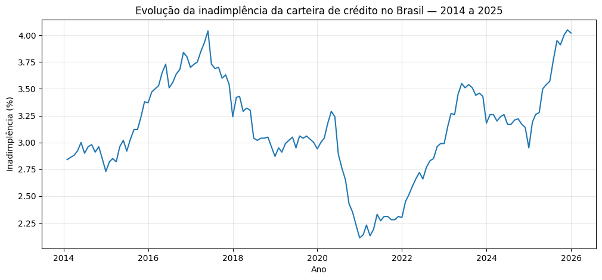

A série histórica indica que a inadimplência apresentou períodos de alta, queda e estabilidade ao longo do intervalo analisado. A taxa média de inadimplência no período foi de **3,12%**, com desvio-padrão de **0,46 ponto percentual**, o que indica variações relevantes ao longo da série.

As estatísticas descritivas da inadimplência foram:

| Estatística | Valor |
|---|---:|
| Média | 3,121736 |
| Desvio-padrão | 0,457974 |
| Valor mínimo | 2,110000 |
| Data do valor mínimo | dez/2020 |
| Valor máximo | 4,050000 |
| Data do valor máximo | nov/2025 |

Esses resultados permitem identificar os momentos de menor e maior inadimplência no período analisado. O menor valor ocorreu em dezembro de 2020, enquanto o maior valor foi registrado em novembro de 2025.

### 3.2 Média anual da inadimplência

Para reduzir a oscilação mensal e facilitar a comparação entre anos, foi calculada a inadimplência média anual.

**Figura 2 — Inadimplência média anual da carteira de crédito**

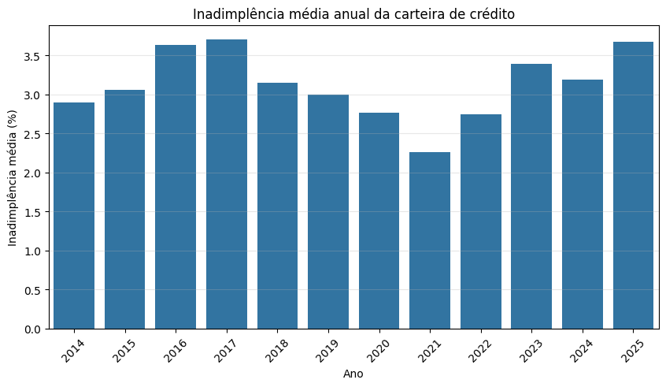

A análise anual mostrou que os maiores níveis médios anuais de inadimplência ocorreram em **2017** e **2025**, enquanto o menor nível foi observado em **2021**. Esse padrão sugere que a inadimplência não evoluiu de forma linear no período, apresentando ciclos de alta e queda.

Tabela-resumo da inadimplência média anual:

| Ano | Inadimplência média | Selic média | Dólar médio |
|---:|---:|---:|---:|
| 2014 | 2,899167 | 0,866667 | 2,353553 |
| 2015 | 3,054167 | 1,045000 | 3,331539 |
| 2016 | 3,634167 | 1,100000 | 3,490114 |
| 2017 | 3,702500 | 0,794167 | 3,192013 |
| 2018 | 3,148333 | 0,520000 | 3,654437 |
| 2019 | 3,000000 | 0,482500 | 3,945086 |
| 2020 | 2,764167 | 0,226667 | 5,155840 |
| 2021 | 2,256667 | 0,362500 | 5,395027 |
| 2022 | 2,748333 | 0,977500 | 5,164753 |
| 2023 | 3,395833 | 1,025833 | 4,994980 |
| 2024 | 3,187500 | 0,865000 | 5,389538 |
| 2025 | 3,670000 | 1,122500 | 5,587886 |

### 3.3 Médias móveis da inadimplência

Também foram calculadas médias móveis de 3 e 12 meses. A média móvel de 3 meses suaviza oscilações de curto prazo, enquanto a média móvel de 12 meses permite observar tendências anuais.

**Figura 3 — Inadimplência e médias móveis de 3 e 12 meses**

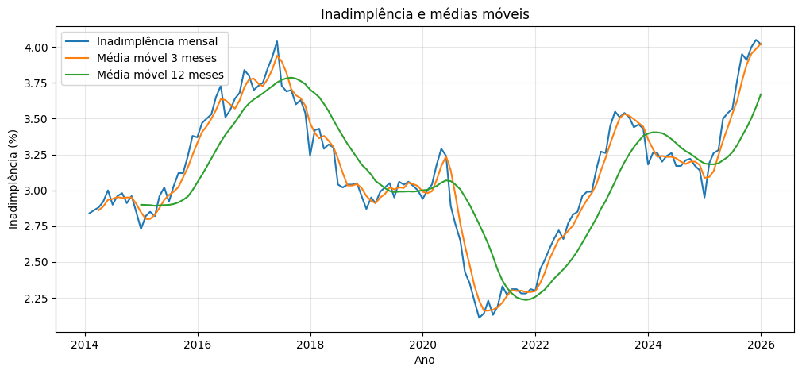

Essa visualização é importante porque a inadimplência pode apresentar ruídos mensais. A média móvel permite observar melhor o comportamento estrutural da série, destacando os movimentos persistentes de alta ou queda. A análise das médias móveis sugere que a inadimplência tende a se ajustar de forma gradual, sem responder de maneira instantânea às mudanças macroeconômicas.

### 3.4 Comparação visual entre inadimplência, Selic e dólar

Como inadimplência, Selic e dólar possuem escalas diferentes, as séries foram padronizadas por z-score. Dessa forma, cada série passa a ser interpretada em relação à sua própria média e desvio-padrão.

**Figura 4 — Séries padronizadas: inadimplência, Selic e dólar**

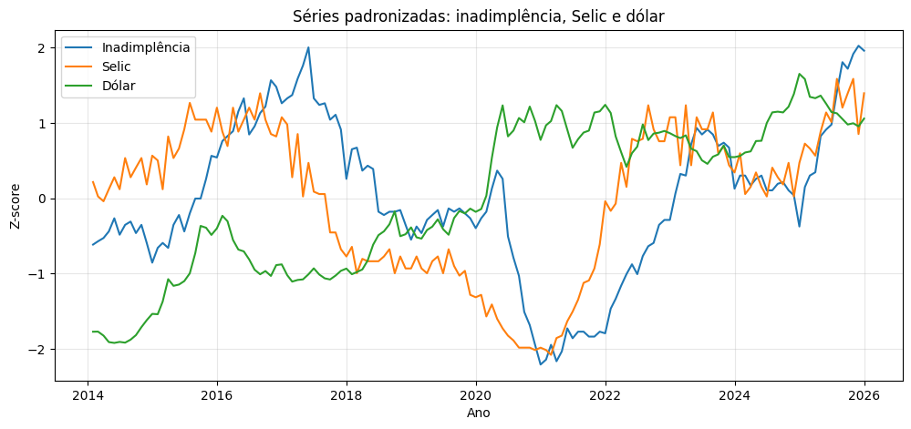

A comparação visual das séries padronizadas mostrou que, em determinados períodos, a inadimplência esteve acima de sua média histórica ao mesmo tempo em que a Selic também estava em patamar elevado. Esse comportamento sugere uma possível associação entre o ambiente de juros e o nível de inadimplência. A relação visual com o dólar foi menos evidente.

A padronização não altera os valores originais para fins estatísticos, mas facilita a comparação gráfica entre indicadores com unidades distintas.

### 3.5 Correlação contemporânea entre as séries

Foram calculadas as correlações contemporâneas entre inadimplência, Selic e dólar, considerando os valores observados no mesmo mês.

#### Correlação de Pearson

| Par de variáveis | Correlação de Pearson |
|---|---:|
| Inadimplência x Selic | 0,596268 |
| Inadimplência x Dólar | -0,219697 |
| Selic x Dólar | -0,122375 |

**Figura 5 — Matriz de correlação de Pearson**

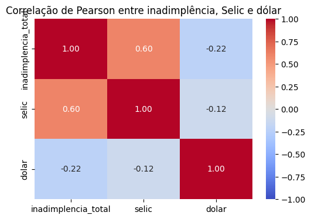

A correlação de Pearson indicou associação positiva moderada entre inadimplência e Selic. O coeficiente de **0,60** sugere que, no período analisado, meses com Selic mais alta tenderam a estar associados a níveis mais altos de inadimplência. Esse resultado é coerente com a interpretação econômica de que juros mais elevados encarecem o crédito e podem aumentar a dificuldade de pagamento de dívidas.

Já a correlação entre inadimplência e dólar foi de **-0,22**, indicando associação negativa fraca. Isso significa que o dólar mais alto não apareceu claramente associado ao aumento da inadimplência na análise contemporânea. A relação existe no sentido estatístico descritivo, mas sua magnitude é baixa.

#### Correlação de Spearman

| Par de variáveis | Correlação de Spearman |
|---|---:|
| Inadimplência x Selic | 0,539416 |
| Inadimplência x Dólar | -0,163263 |
| Selic x Dólar | -0,093574 |

**Figura 6 — Matriz de correlação de Spearman**

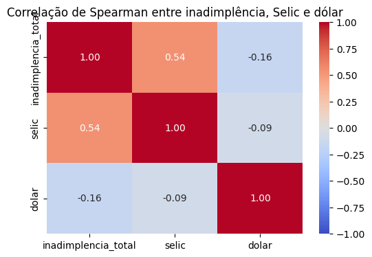

A correlação de Spearman também apontou associação positiva moderada entre inadimplência e Selic, com coeficiente de **0,54**. Isso reforça que a relação entre as duas variáveis não depende apenas de uma relação linear simples, mas também aparece como padrão monotônico.

No caso do dólar, a correlação de Spearman foi negativa e fraca, com coeficiente de **-0,16**, confirmando que a relação entre dólar e inadimplência foi pouco expressiva no período analisado.

### 3.6 Testes estatísticos de correlação

Foram realizados testes de correlação para avaliar se as associações entre inadimplência e os indicadores macroeconômicos foram estatisticamente significativas.

| Relação testada | Método | Coeficiente | p-valor | Decisão |
|---|---|---:|---:|---|
| Inadimplência x Selic | Pearson | 0,5963 | 3,1437e-15 | Rejeita H0 — correlação significativa |
| Inadimplência x Selic | Spearman | 0,5394 | 3,0426e-12 | Rejeita H0 — correlação significativa |
| Inadimplência x Dólar | Pearson | -0,2197 | 0,0081 | Rejeita H0 — correlação significativa |
| Inadimplência x Dólar | Spearman | -0,1633 | 0,0506 | Não rejeita H0 — sem evidência suficiente |

Considerando nível de significância de 5%, os resultados indicam que as correlações entre inadimplência e Selic foram estatisticamente significativas tanto pelo método de Pearson quanto pelo método de Spearman. A correlação de Pearson entre inadimplência e Selic foi de **0,5963**, com p-valor muito inferior a 0,05, indicando associação linear positiva moderada. A correlação de Spearman também foi positiva e moderada, com coeficiente de **0,5394** e p-valor inferior a 0,05, reforçando a existência de associação monotônica entre as variáveis.

No caso da relação entre inadimplência e dólar, o teste de Pearson apresentou coeficiente de **-0,2197** e p-valor de **0,0081**, indicando uma correlação linear negativa fraca, porém estatisticamente significativa. Já o teste de Spearman apresentou coeficiente de **-0,1633** e p-valor de **0,0506**, valor ligeiramente acima do nível de significância de 5%. Portanto, nesse caso, não há evidência estatística suficiente para afirmar uma associação monotônica significativa entre inadimplência e dólar.

De forma geral, os resultados sugerem que a Selic apresentou uma associação mais consistente com a inadimplência do que o dólar comercial. Enquanto a relação entre inadimplência e Selic foi significativa nos dois métodos, a relação com o dólar foi fraca e dependeu do método utilizado.

### 3.7 Gráficos de dispersão

Foram gerados gráficos de dispersão para visualizar a relação entre inadimplência e cada indicador macroeconômico.

**Figura 7 — Relação entre inadimplência e Selic**

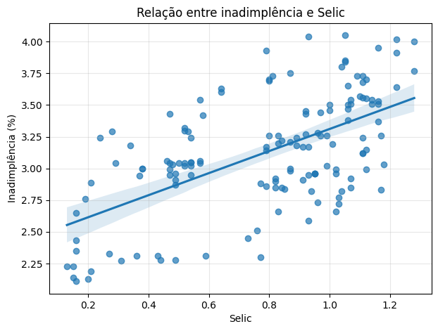

A análise visual sugere que o gráfico de dispersão entre inadimplência e Selic indica uma associação positiva entre as variáveis. A inclinação ascendente da reta de tendência sugere que períodos com Selic mais elevada estiveram associados a maiores níveis de inadimplência. Esse resultado é coerente com a hipótese econômica de que juros mais altos encarecem o crédito e podem aumentar a dificuldade de pagamento de dívidas por famílias e empresas.

**Figura 8 — Relação entre inadimplência e dólar comercial**

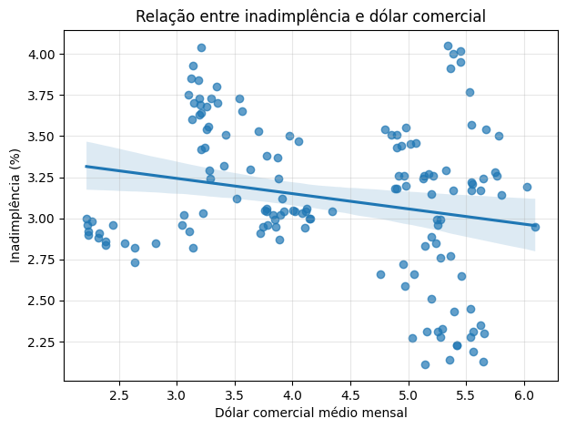

A análise visual sugere uma associação negativa fraca entre inadimplência e dólar comercial. A reta de tendência apresenta inclinação levemente descendente, mas os pontos estão bastante dispersos. Isso indica que o dólar comercial não apresentou relação forte com a inadimplência no período analisado.

Os gráficos de dispersão complementam a matriz de correlação, pois permitem observar padrões, concentração de pontos, possíveis outliers e eventuais relações não lineares.

### 3.8 Correlação com defasagens

Além da correlação contemporânea, foram analisadas correlações com defasagens de 1 a 12 meses para Selic e dólar. Essa etapa é importante porque os efeitos de juros e câmbio sobre a inadimplência podem ocorrer com atraso.

#### Selic defasada

**Figura 9 — Correlação entre inadimplência e Selic defasada**

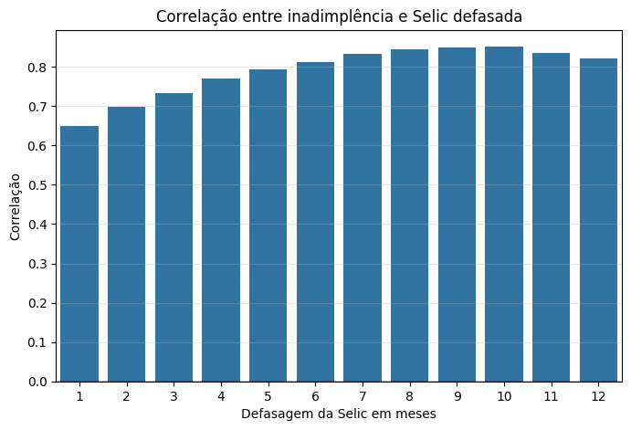

Tabela de correlações com defasagem da Selic:

| Defasagem da Selic | Correlação com inadimplência |
|---:|---:|
| 1 mês | 0,649566 |
| 2 meses | 0,697724 |
| 3 meses | 0,733332 |
| 4 meses | 0,769462 |
| 5 meses | 0,794509 |
| 6 meses | 0,812864 |
| 7 meses | 0,833513 |
| 8 meses | 0,845044 |
| 9 meses | 0,848373 |
| 10 meses | 0,851581 |
| 11 meses | 0,835124 |
| 12 meses | 0,821005 |

A análise de defasagens mostra que a correlação entre Selic e inadimplência aumenta à medida que a Selic é defasada. O maior coeficiente foi observado em **10 meses de defasagem**, com correlação de **0,851581**. Esse resultado sugere que mudanças na taxa Selic podem estar associadas à inadimplência com atraso. Essa interpretação é plausível do ponto de vista econômico, pois o aumento dos juros tende a afetar gradualmente o custo das dívidas, a renovação de crédito e a capacidade de pagamento dos tomadores.

#### Dólar defasado

**Figura 10 — Correlação entre inadimplência e dólar defasado**

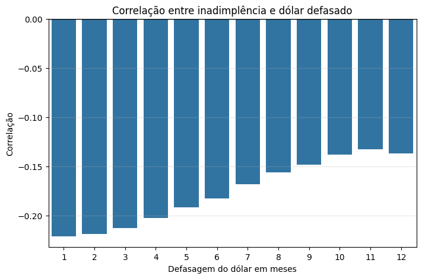

Tabela de correlações com defasagem do dólar:

| Defasagem do dólar | Correlação com inadimplência |
|---:|---:|
| 1 mês | -0,221266 |
| 2 meses | -0,218931 |
| 3 meses | -0,213096 |
| 4 meses | -0,202839 |
| 5 meses | -0,191862 |
| 6 meses | -0,182495 |
| 7 meses | -0,168487 |
| 8 meses | -0,156015 |
| 9 meses | -0,148445 |
| 10 meses | -0,138254 |
| 11 meses | -0,132708 |
| 12 meses | -0,136671 |

A análise com defasagens do dólar comercial manteve correlações negativas e fracas em todos os intervalos analisados. Mesmo nas maiores magnitudes, próximas de **-0,22**, a associação permaneceu baixa. Isso reforça que o dólar comercial não apresentou relação forte com a inadimplência da carteira de crédito no período analisado, nem no mesmo mês nem com defasagens de até 12 meses.

### 3.9 Análise das variações mensais

Além de analisar o nível das séries, foram calculadas as variações mensais da inadimplência, da Selic e do dólar.

Essa abordagem busca responder se aumentos mensais nos juros ou no câmbio coincidem com aumentos mensais na inadimplência.

**Figura 11 — Correlação entre variações mensais**

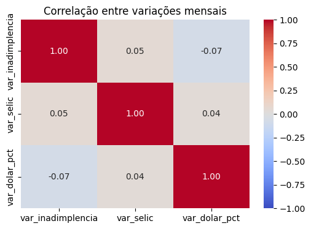

Tabela de correlações entre variações mensais:

| Par de variáveis | Correlação |
|---|---:|
| Variação da inadimplência x variação da Selic | 0,048181 |
| Variação da inadimplência x variação percentual do dólar | -0,071303 |

A matriz de correlação das variações mensais apresentou coeficientes próximos de zero. Isso indica que aumentos ou quedas mensais na Selic e no dólar não se associaram fortemente a aumentos ou quedas mensais imediatas da inadimplência. Esse resultado reforça a hipótese de que a inadimplência responde de forma mais gradual às condições macroeconômicas, especialmente aos juros, em vez de reagir instantaneamente no mesmo mês.

---

## 4. Conclusão

A análise exploratória da inadimplência da carteira de crédito no Brasil entre 2014 e 2025 permitiu identificar padrões importantes na evolução da série e em sua relação com a taxa Selic e o dólar comercial.

A inadimplência apresentou períodos de elevação, estabilidade e queda ao longo do intervalo analisado. A série não se comportou de forma constante, indicando que a inadimplência responde a diferentes momentos do ciclo econômico e às condições do mercado de crédito. A análise das médias móveis também mostrou que a inadimplência tende a se ajustar de forma gradual, com movimentos mais claros quando observada em janelas de médio prazo.

A relação com a Selic indicou uma associação positiva relevante. A correlação contemporânea entre inadimplência e Selic foi positiva e moderada, tanto pelo método de Pearson quanto pelo método de Spearman. Além disso, a análise com defasagens mostrou que essa associação se torna ainda mais forte quando a Selic é considerada com atraso de alguns meses, atingindo correlação de aproximadamente **0,85** com **10 meses de defasagem**. Esse resultado sugere que mudanças no nível de juros podem estar associadas à inadimplência de forma gradual, e não necessariamente imediata.

A relação com o dólar comercial foi mais fraca. A correlação contemporânea entre inadimplência e dólar apresentou sinal negativo e baixa magnitude. Mesmo na análise com defasagens, os coeficientes permaneceram fracos, indicando que o dólar não apresentou associação expressiva com a inadimplência da carteira de crédito no período analisado. Assim, entre os dois indicadores avaliados, a Selic demonstrou relação mais consistente com a evolução da inadimplência.

A análise das variações mensais reforçou essa interpretação. As correlações entre as variações mensais da inadimplência, da Selic e do dólar ficaram próximas de zero, indicando que a inadimplência não reage de forma imediata às oscilações mensais desses indicadores. Esse resultado é coerente com a hipótese de que a inadimplência é um fenômeno de ajuste gradual, influenciado por condições acumuladas de crédito, juros, renda e endividamento.

De forma geral, os resultados sugerem que a inadimplência pode estar associada ao ambiente macroeconômico, especialmente às condições de juros. No entanto, é importante destacar que as correlações encontradas não implicam causalidade. A inadimplência é influenciada por diversos fatores, como renda, desemprego, inflação, endividamento das famílias, política de concessão de crédito, renegociação de dívidas e atividade econômica.

Como limitação, este estudo utilizou apenas três séries principais e adotou uma abordagem exploratória. Estudos futuros poderiam incluir outros indicadores, como taxa de desemprego, rendimento médio, PIB, inflação, endividamento das famílias, comprometimento de renda e volume de concessões de crédito. Também seria possível aplicar modelos econométricos mais avançados para investigar relações dinâmicas entre as variáveis.

Ainda assim, a análise atende ao objetivo proposto ao investigar a evolução histórica da inadimplência no Brasil e sua relação com dois indicadores macroeconômicos relevantes. Os resultados indicam que a taxa Selic apresentou uma associação mais forte e consistente com a inadimplência do que o dólar comercial, especialmente quando considerada com defasagem temporal.

---

## 5. Referências

- Banco Central do Brasil. Sistema Gerenciador de Séries Temporais — SGS.
- Banco Central do Brasil. Série 21082 — Inadimplência da carteira de crédito — total.
- Banco Central do Brasil. Série 4390 — Taxa Selic acumulada no mês.
- Banco Central do Brasil. Série 1 — Taxa de câmbio livre — dólar americano venda.
- Documentação das bibliotecas Python utilizadas: pandas, numpy, matplotlib, seaborn e scipy.

---

## 6. Declaração de uso de IA

Ferramentas de inteligência artificial foram utilizadas como apoio na estruturação do notebook, organização metodológica, sugestão de análises exploratórias, revisão textual e elaboração preliminar do relatório. A coleta dos dados, execução dos códigos, validação dos resultados, interpretação dos gráficos e conclusões finais foram revisadas pelos integrantes do grupo. Foi utilizado o Github Copilot for Students.
